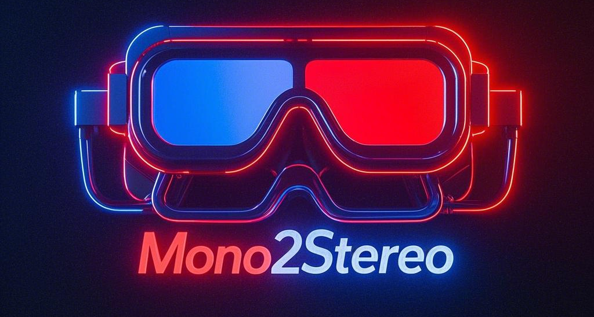
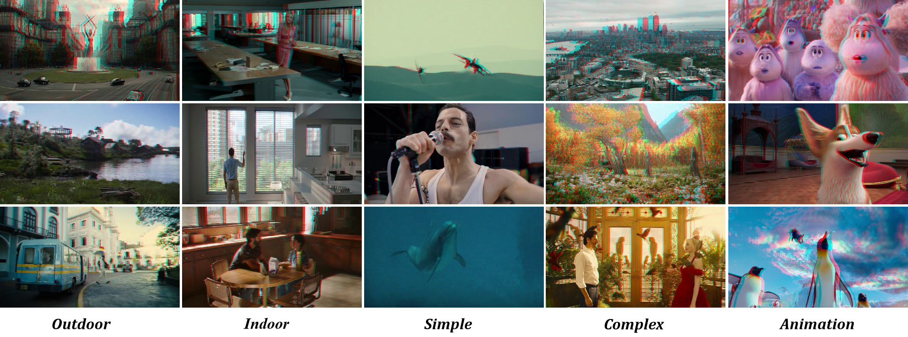

# Mono2Stereo: A Benchmark and Empirical Study for Stereo Conversion
<div align="center">
  
 <br>
 <a href='https://arxiv.org/abs/2409.02095'></a> &nbsp;
 <a href='https://mono2stereo-bench.github.io/'></a> &nbsp;
</div>
<div align="center">
<a href="https://song2yu.github.io/"><sup>1</sup>Songsong Yu</a> |
<a href="https://scholar.google.com/citations?hl=zh-CN&user=dEm4OKAAAAAJ&view_op=list_works"><sup>2</sup> Yuxin Chen</a> |
<a href="https://scholar.google.com/citations?user=ysXmZCMAAAAJ&hl=zh-CN&oi=ao"><sup>3</sup>Zeke Xie</a> |
<a href="https://scholar.google.com/citations?user=j1XFhSoAAAAJ&hl=zh-CN&oi=ao"><sup>1</sup>Yifan Wang</a> |
<a href="https://scholar.google.com/citations?user=EfTwkXMolscC&hl=zh-CN&oi=ao"><sup>1</sup>Lijun Wang</a> |
<a href="https://scholar.google.com/citations?user=zJvrrusAAAAJ&hl=zh-CN&oi=ao"><sup>2</sup>Zhongang Qi</a> |
<a href="https://scholar.google.com/citations?user=4oXBp9UAAAAJ&hl=zh-CN&oi=ao"><sup>2</sup>Ying Shan</a> |
<a href="https://scholar.google.com/citations?user=D3nE0agAAAAJ&hl=zh-CN&oi=ao"><sup>1</sup>Huchuan Lu</a>
<br>
<sup>1</sup>Dalian University of Technology 
<sup>2</sup>ARC Lab, Tencent PCG
<sup>3</sup>The Hong Kong University of Science and Technology (Guangzhou)
</div>
CVPR 2025

<div align="left">
<br>
With the rapid growth of 3D devices and a shortage of 3D content, stereo conversion is gaining attention. Recent studies have introduced pretrained Diffusion Models (DMs) for this task, but the lack of large-scale training data and comprehensive benchmarks has hindered optimal methodologies and accurate evaluation. To address these challenges, we introduce the Mono2Stereo dataset, providing high-quality training data and benchmarks. Our empirical studies reveal:
<br>
1. Existing metrics fail to focus on critical regions for stereo effects.
<br>
2.Mainstream methods face challenges in stereo effect degradation and image distortion.
<br>
We propose a new evaluation metric, Stereo Intersection-over-Union (Stereo IoU), which prioritizes disparity and correlates well with human judgments. Additionally, we introduce a strong baseline model that balances stereo effect and image quality.
</div>


<div align="center">
  
</div>

## 📢 News
2025-03-16: [Project page](https://mono2stereo-bench.github.io/) and inference code (this repository) are released.<br>
2025-02-27: Accepted to CVPR 2025. <br>


## 🛠️ Setup

The inference code was tested on:

- Python 3.8.20,  CUDA 12.1

## 📦 Usage
**Preparation**
<br>
You can download our model [weights](https://mono2stereo-bench.github.io/) to perform inference.


**Installation**

Clone the repository (requires git):

```bash
git clone https://github.com/song2yu/Mono2Stereo.git
cd mono2stereo
```

create a Python native virtual environment and install dependencies into it:

```bash
conda create -n stereo python=3.8 -y
conda activate stereo
pip install -r requirements.txt
```

**Inference**
```bash
python run.py --encoder <vits | vitb | vitl> --img-path  --outdir <outdir> [--pred-only] [--grayscale]
```
**Dataset**
<br>
We provide the data processing code in data_process.py. The video data can be downloaded from this [website](https://www.3donlinefilms.com/). 
<br>
We provide test data for fair comparison. Additionally, we recommend using the [Inria 3DMovies](https://www.di.ens.fr/willow/research/stereoseg/) for model testing.


## Acknowledgement
we thank.....

## Citation

If you find this project useful, please consider citing:

```bibtex
@inproceedings{depthanything,
      title={Depth Anything: Unleashing the Power of Large-Scale Unlabeled Data}, 
      author={Yang, Lihe and Kang, Bingyi and Huang, Zilong and Xu, Xiaogang and Feng, Jiashi and Zhao, Hengshuang},
      booktitle={CVPR},
      year={2024}
}
```

